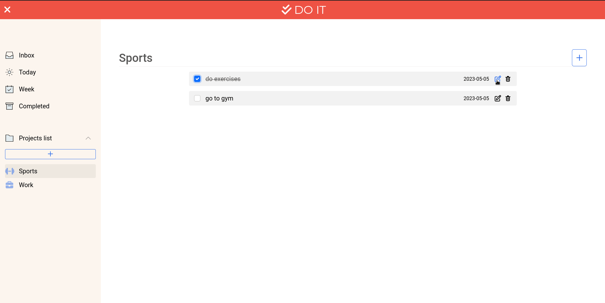

# To-Do List Web App

This is a simple web application that allows users to create and manage a to-do list.

## Screenshot



## Features

- Create tasks, edit them, remove them, and add them to projects.
- Responsive design for mobile devices (coming soon).

## Technologies Used

- HTML
- CSS
- JavaScript
- Bootstrap

## Getting Started

To get started with this application, there are two methods:

1. Use the live demo: [https://rahhaly.github.io/todo-list](https://rahhaly.github.io/todo-list).
2. Clone the repository by running the following command in your terminal:

```bash
git clone https://github.com/rahhaly/todo-list.git
```

Enter the project folder in your terminal:

```bash
cd todo-list
```

Then install project dependencies running:

```bash
npm install
```

And finally, start the application in your browser by running:

```bash
npm start
```

**IMPORTANT NOTE**: you need to have [Node](https://nodejs.org/en/download) installed on your computer in order to use the second method.

## Contributing

If you'd like to contribute to this project, please fork the repository and create a pull request with your changes.

## License

This project is licensed under the [MIT License](https://opensource.org/licenses/MIT).
